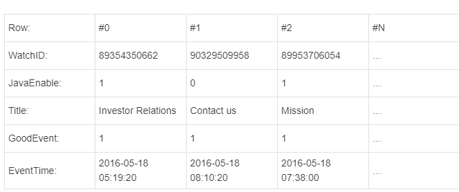

- [`Clickhouse`基础](#clickhouse基础)
- [什么是`ClickHouse`?](#什么是clickhouse)
- [`OLAP`场景关键特征](#olap场景关键特征)
  - [ClickHouse更适合的原因](#clickhouse更适合的原因)
  - [输入/输出](#输入输出)
- [`ClickHouse`特征](#clickhouse特征)
  - [列示存储](#列示存储)
  - [DBMS的功能](#dbms的功能)
  - [多样化引擎](#多样化引擎)
  - [高吞吐写入能力](#高吞吐写入能力)
  - [数据分区与线程级并行](#数据分区与线程级并行)
  - [性能对比:](#性能对比)
- [安装与启动](#安装与启动)
  - [准备步骤(参考)](#准备步骤参考)
  - [开启后台服务](#开启后台服务)
  - [客户端连接](#客户端连接)
- [数据类型](#数据类型)

# `Clickhouse`基础
官方文档:https://clickhouse.com/docs/zh/
# 什么是`ClickHouse`?
用于联机分析`(OLAP)`的列式数据库管理系统`(DBMS)`

常见的行式数据库有: `Mysql, Postgres....`

列示数据库适合宽表(字段多的数据)

在列式数据库系统中，数据按如下的顺序存储：



来自不同列的值被单独存储，来自同一列的数据被存储在一起。

# `OLAP`场景关键特征
* 多数是读请求
* 数据以相当大批次更新(>1000行), 而不是单行更新
* 已添加到数据库的数据不能修改
* 对于读取,从数据库中提取相当多的行,但只提取列的一小部分
* 事务不是必须
* 每个查询都有一个大表
* 查询结果明显小于源数据

## ClickHouse更适合的原因
* 行式: 需要一行一行找对应去聚合
* 列式: 找到列对应的点聚合

## 输入/输出
* 针对分析类查询，通常只需要读取表的一小部分列 --- **减少读取IO**
* 由于数据总是打包成批量读取的，所以压缩是非常容易的。同时数据按列分别存储这也更容易压缩。这进一步降低了I/O的体积。 --- **进一步减少数据体积**

# `ClickHouse`特征
## 列示存储
## DBMS的功能
几乎覆盖SQL大部分语法,包括DDL和DML 以及配套各种函数, 用户管理以及权限管理, 数据备份与恢复

## 多样化引擎
分为库引擎,表引擎, 根据表不同需求可以设定不同的存储引擎, 目前包含 `MergeTree, 日志, 接口 和其他四大类`20多种引擎
## 高吞吐写入能力
* 采用`LSM Tree`的结构, `数据写入缓存后定期在后台合并Compaction`
* 通过类LSM Tree结构, ClickHouse在数据导入时全部是`顺序append写`
  * 新老数据都会插入, 但是会有自己的版本号, 查询只会查到最大的版本号,即为最新
  * 删除老数据的时候,只会在合并动作时候进行删除老数据
## 数据分区与线程级并行
**任何一个数据写入都会先产生一个临时分区.不会纳入任何一个已有的分区**

数据划分为`多个Partition`,每个Partition再进一步划分为`多个index granularity(索引粒度)`, 然后通过多个CPU分别处理其中一部分来进行并行数据的处理

所以在这种设计下,**单条Query就能利用整机的CPU**;

弊端: `单条查询使用多CPU,不利用同时并发多条查询, 所以QPS过高查询并不是强项`;

## 性能对比:
1- 单表查询 -- 最快

2- 关联查询-- 表现比较差 -- 所以不适合进行关联查询,不过一般很少用

# 安装与启动
## 准备步骤(参考)
1. 关闭防火墙先
2. centos取消最大打开文件Limit -- 原因: ClickHouse耗费CPU高, 占用磁盘资源大
   1. 查看文件数 -- `ulimit -a`
   2. 修改-- `sudo vim /etc/security/limits.conf
      * soft nofile 65536    -- 第一列 * 表示 所有用户 , 或者 liukaitao@group_name
      * hard nofile 65536  -- 第二列 soft 下限 hard 上限
      * soft nproc 131072 -- nofile 打开的文件数  , nproc 打开的进程数
      * hard nproc 131072
    3. 也配一下  /etc/security/limits.d下面的conf   -- 这个一般也会覆盖上面conf

官方安装文档
https://clickhouse.com/docs/zh/getting-started/install
启动
## 开启后台服务
```bash
`sudo /etc/init.d/clickhouse-server start`
## 使用配置文件启动
--config-file=/etc/clickhouse-server/config.xml
```
日志存放在`/var/log/clickhouse-server`文件夹

启动配置文件`/etc/clickhouse-server/config.xml`中配置
也可以在 /var/lib/clickhouse
## 客户端连接
```bash
# 默认使用default用户并不携带密码连接到localhost:9000
clickhouse-client 
-h hostname
-m 交互式命令
-p 端口默认9000
-query 直接使用语句
```

# 数据类型
* 整数类型 Int8, Int16 Int32 Int64
* 无符号整数型 Uint8, Uint16, Uint32, Uint64
* 浮点型 -Float32- float, Float64- double
* 布尔型 - 没有独特的布尔值, 一般使用Uint8类型 取值限制0或1
* `Decimal`型 - 有符号的浮点数, 可在加减和乘法运算中保持精度
  * Decimal32(5) 有效位数(整数+小数)= 9位, 小数部分保留5位  
  * Decimal64(xx) 有效位数是18位
  * Decimal128 是38位
* 字符串 String 可以任意长度
  * FixedString(N) 固定长度N的字符串, 不够会补全  - 很少使用
* 枚举类型Enum
  * Enum8,是用String=int8描述  Enum16 是用String = int16描述
* 时间类型
  * Date 年月日
  * Datetime 年月日时分秒
  * Datetime64 年月日时分秒毫秒
* 数组 Array(T) 由T类型组成的数组
* 空值Nullable(typename) -- https://clickhouse.com/docs/zh/sql-reference/data-types/nullable
  * 允许用特殊标记(Null(表示缺失值, 可以与TypeName的正常值存放一起 比如 Nullable(Int8)类型的列可以存储Int8的值,没有值的行将存储Null
