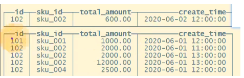
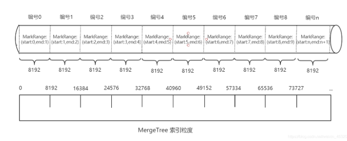
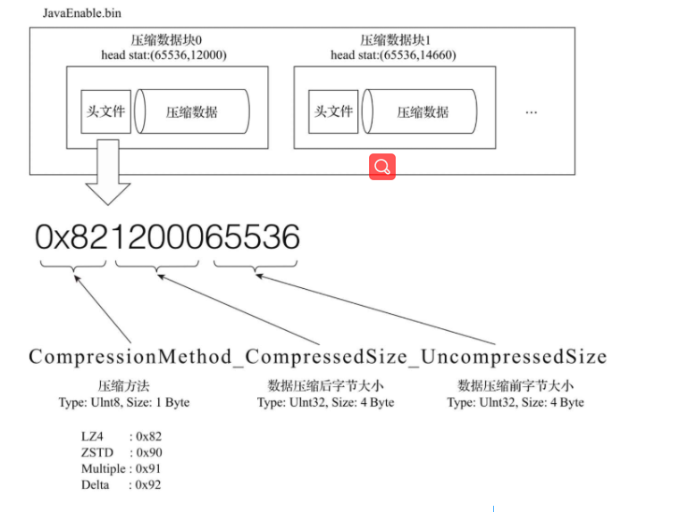
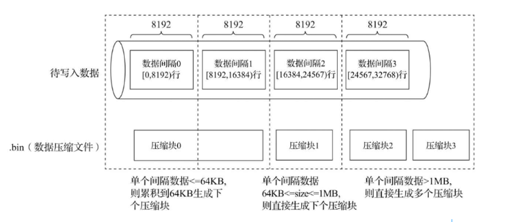
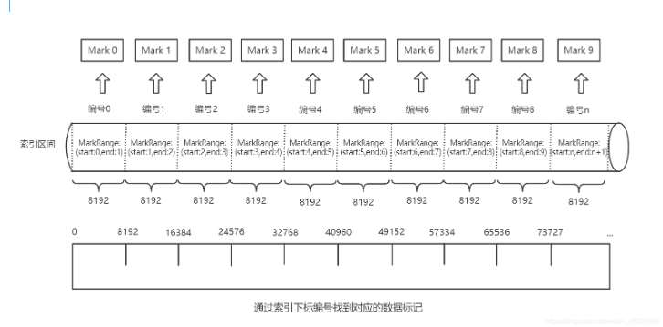
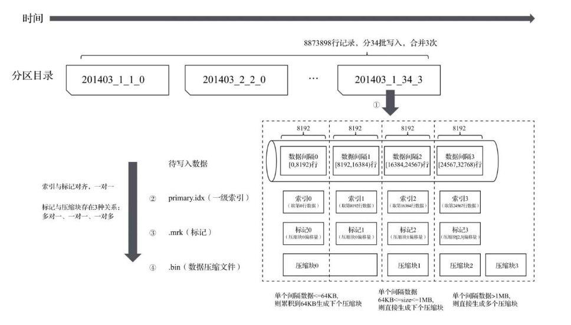
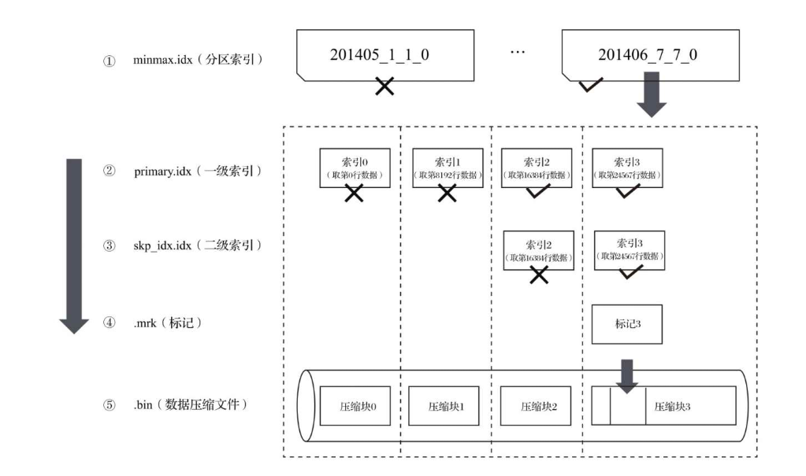

- [表引擎](#表引擎)
- [`TinyLog`](#tinylog)
- [`Memory`](#memory)
- [常用`MergeTree`](#常用mergetree)
  - [`partition by` 分区(可选)](#partition-by-分区可选)
  - [`Primary key 主键`(可选)](#primary-key-主键可选)
  - [`Order by 排序`(必选)](#order-by-排序必选)
  - [二级索引](#二级索引)
  - [数据TTL](#数据ttl)
  - [列级别TTL](#列级别ttl)
  - [表级别TTL](#表级别ttl)
- [数据存储](#数据存储)
  - [压缩数据块 -- `.bin文件`](#压缩数据块----bin文件)
  - [数据标记 -- `.mrk文件`](#数据标记----mrk文件)
  - [数据标记的工作方式](#数据标记的工作方式)
- [对分区,索引,标记和压缩数据的协同总结](#对分区索引标记和压缩数据的协同总结)
  - [写入过程](#写入过程)
  - [查询过程](#查询过程)
  - [ReplacingMergeTree](#replacingmergetree)
    - [去重时机](#去重时机)
    - [去重范围](#去重范围)
  - [SummingMergeTree](#summingmergetree)


# 表引擎
表引擎决定了如何存储表的数据: 包括
1. 数据的存储方式和位置, 写到哪里以及从哪里读取
2. 支持哪些查询以及如何支持
3. 并发数据访问
4. 索引的使用(如果存在)
5. 是否可以执行多线程请求
6. 数据复制参数

**特别注意: 引擎名称大小写敏感**
# `TinyLog`
1. 列文件形式保存在磁盘上
2. 不支持索引
   
多数只用于本地测试
```sql
create_tale t_tinylog(id String, name String) ENGINE TinyLog;
```
# `Memory`
* 内存引擎, 数据未压缩直接保存在内存当中, 重启宕机就会消失
* 简单查询下非常高性能 10G
# 常用`MergeTree`
参考文档: https://blog.csdn.net/weixin_45320660/article/details/112761790

最强大的引擎 -- MergeTree(合并树)引擎及该系列
```sql
CREATE TABLE [IF NOT EXISTS] [db.]table_name [ON CLUSTER cluster]
(
    name1 [type1] [DEFAULT|MATERIALIZED|ALIAS expr1] [TTL expr1],
    name2 [type2] [DEFAULT|MATERIALIZED|ALIAS expr2] [TTL expr2],
    ...
    INDEX index_name1 expr1 TYPE type1(...) GRANULARITY value1,
    INDEX index_name2 expr2 TYPE type2(...) GRANULARITY value2,
    ...
    PROJECTION projection_name_1 (SELECT <COLUMN LIST EXPR> [GROUP BY] [ORDER BY]),
    PROJECTION projection_name_2 (SELECT <COLUMN LIST EXPR> [GROUP BY] [ORDER BY])
) ENGINE = MergeTree()
ORDER BY expr
[PARTITION BY expr]
[PRIMARY KEY expr]
[SAMPLE BY expr]
[TTL expr
    [DELETE|TO DISK 'xxx'|TO VOLUME 'xxx' [, ...] ]
    [WHERE conditions]
    [GROUP BY key_expr [SET v1 = aggr_func(v1) [, v2 = aggr_func(v2) ...]] ] ]
[SETTINGS name=value, ...]
```
创建表例子:
```sql
create table t_order_mt(
    id Uint32,
    sku_id String,
    total_amount Decimal(16,2)
    create_time Datetime
) engine = MergeTree
    partition by toYYYYMMDD(create_time) -- 分区key
    primary key(id)    -- 主键索引, 并不唯一
    order by(id, sku_id) -- 排序字段
```


此时可以看到id可以不唯一, 也是排好序, 分区分了两个

## `partition by` 分区(可选)
作用: **主要是降低扫描的范围,优化查询速度**

如果不写,只会使用一个分区(all分区)

> 并行: 分区后, 面对涉及跨分区的查询统计,ClickHouse会以分区为单位 并行处理
> 可以去/var/lib/clickhouse/data里面看分区后的数据, 看到分区文件夹命名PartitionId_MinBlockNum_MaxBlockNum_Level
>PartitionId -- 由分区ID决定 .... 日期类, 整型类
>MinBlock, MaxBlock 就是数据的版本, 用于合并
>Level是合并的版本号

任何一个数据写入都会先产生一个临时分区.不会纳入任何一个已有的分区

`写后一般10s后合并, CLickHouse会自动合并执行`, 也可以手动optimize
## `Primary key 主键`(可选)
用的是`稀疏索引`(不会每行数据索引都记录它的位置), 查找的时候类似使用二分查找
`主键的设定主要依据是查询语句中的where条件`

`Index granularity 索引粒度` -- 指两个相邻索引对应数据的间隔 默认是8192



## `Order by 排序`(必选)
设定了分区内的数据按哪些顺序进行有序保存

要求: 主键必须是order by 字段的前缀字段, 类似索引左侧原则

## 二级索引
又称为`跳树索引`, 由数据的聚合信息构建而成

MergeTree支持跳数索引类型：`minmax、set、ngrambf_v1和tokenbf_v1`。

## 数据TTL
TimeToLive 提供了可以管理数据表或者列的生命周期的功能

## 列级别TTL
```sql
create table t_order_mt3(
    id UInt32,
    sku_id String,
    total_amount Decimal(16,2) TTL create_time+interval 10 SECOND, // 列级别的TTL, create_time 10s后会置空默认值
    create_time Datetime
) engine = MergeTree
```
## 表级别TTL
`alter table t_order_mt3 MODIFY TTL create_time + INTERVAL 10 SECOND `(可以各种时间单位)
按每行数据陆续删除


# 数据存储
数据是`按列存储`的, 具体到每个列字段都会对应一个`.bin`的数据文件

`.bin`文件只会保存当前分区片段内的这一部分数据
1. 首先数据经过压缩(支持多种算法)
2. 数据事先按照OrderBY声明排序
3. 最后以多个压缩数据块形式被组织并写入.bin文件中

## 压缩数据块 -- `.bin文件`
目的: **减少数据大小,降低存储空间; 读取更快,将压缩数据加载到内存中解压读取
一个压缩数据块由头信息和压缩数据两部分组成**



> 从图所示中能够看到，.bin压缩文件是由多个压缩数据块组成的，而每个压缩数据块的头信息则是基于`CompressionMethod_CompressedSize_UncompressedSize`公式生成的。

​ MergeTree在数据具体写入过程中，`会按照索引粒度，按批次获取数据`并进行处理。如下图：


## 数据标记 -- `.mrk文件`
`primary.idx` 一级索引

`.bin` 数据文件

`.mrk` 为一级索引和数据文件之间建立的关联: 主要记录: 
1. 一级索引对应的页码信息
2. 一段文字在某一页中的起始位置


特征: 
1. `数据标记文件和索引区间`是对齐的。都是按照`index_granularity`的粒度间隔划分。
2. `数据标记文件和.bin文件也是一一对应`。每一个列字段\[column].bin文件都有一个对应的\[column].mrk数据标记文件，用于记录数据在.bin文件中偏移量信息。
   
**标记数据与一级索引不同，它不能常驻内存，而是使用LRU（最近最少使用）缓存策略加快其取用速度。**
## 数据标记的工作方式
查找过程大致分为读取压缩数据块和读取数据两个步骤


MergeTree如何定位压缩数据块并读取数据：
1. 读取压缩数据块：`**在查询某一列数据MergeTree无须一次性加载整个.bin文件。借住标记文件中的压缩文件偏移量加载指定的数据压缩块**`。
2. 读取数据：`解压后的数据，MergeTree并不需要一次性扫描整段解压数据，借住标记文件中保存的数据块中偏移量以index_granularity的粒度加载特定一小段`

# 对分区,索引,标记和压缩数据的协同总结
## 写入过程
1. 生成分区目录(伴随每一次insert操作)
2. 在后续某个时刻,合并相同分区的目录
3. 按照索引粒度, 分别**生成Primary.idx索引文件, 二级索引, 每一列字段的.mrk数据标记和.bin的压缩数据文件**


根据分区目录：201403_1_34_3得知：

​ 该分区的N行数据，34次分批写入，合并3次。
## 查询过程
1. minmax.idx(分区索引)
2. primary.idx(一级索引)
3. skp_idx.idx(二级索引)
4. ...mrk(标记文件)
5. ...bin(数据压缩文件)



查询语句中没有where条件，1,2,3步骤不走；先扫描所有分区目录，及目录内索引段的最大区间

MergeTree借住数据标记，多线程的形式读取多个压缩块。

## ReplacingMergeTree
是`MergeTree的一个变种`, 存储特性任何都完全继承于MergeTree, 只是`多了个去重功能`

`是依据于OrderBy字段进行去重的,不是PrimaryKey主键`

### 去重时机
数据去重只会在合并过程中出现,会在未知时间在后台进行, 只能保证最终一致性
### 去重范围
如果`表经过了分区,去重只会在分区内部进行去重,不能执行跨分区的去重`
```sql
create table ...(
    ...
) ENGINE = ReplacingMergeTree(create_time)
order by (id, sku_id)
```
`ReplacingMergeeTree() 填入的参数为版本字段,重复数据保留版本字段值最大的, 如果不填,默认保留最后一条`

## SummingMergeTree
聚合树, 对于不查询明细,`只关心以维度进行汇总聚合结果的场景`
`能够"预聚合"的引擎, 进行的是分区内聚合`
```sql
create ...
    total_amount Decimal(16,2)
) engine = SummingMergeTree(total_amount)
    partition by ...
    primary_key(id)
    order_by(id, sku_id)
```
`预聚合的维度是依据orderBy字段的 `, 可以理解成group by `OrderBY的字段`   ,其他字段合并之后取的是最早的那条

注意事项: SELECT 使用时候也是需要SUM()的, 因为可能存在一些没来得及合并聚合的数据