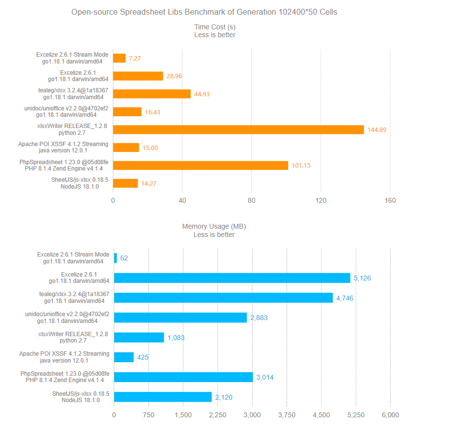
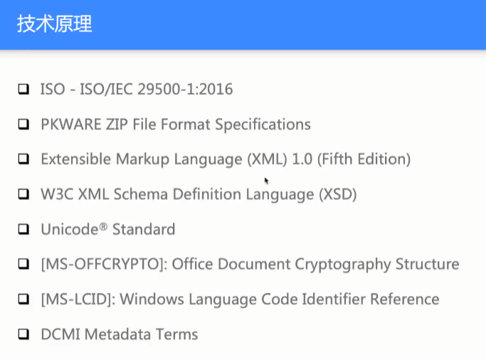
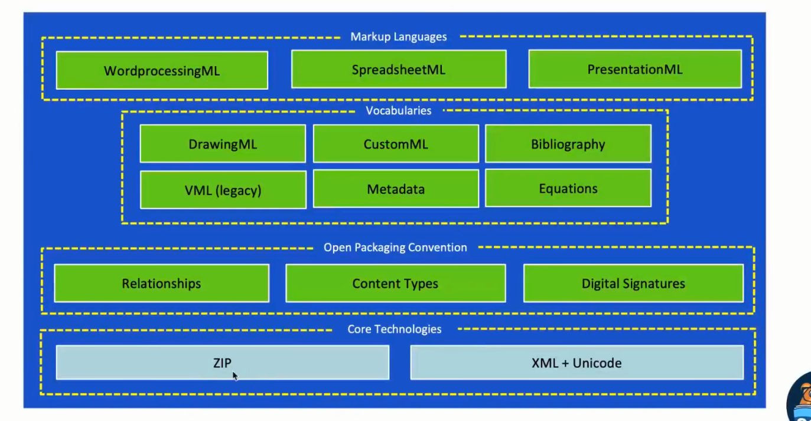
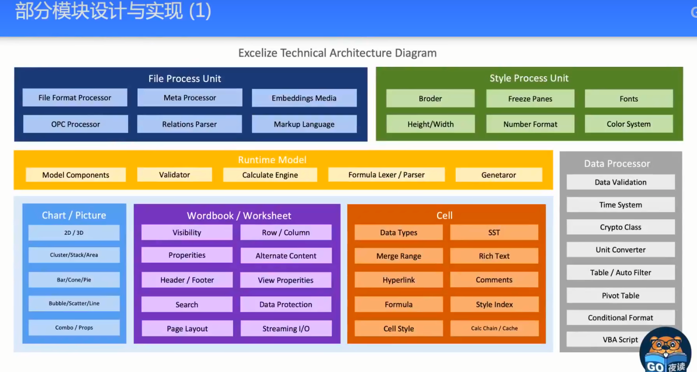
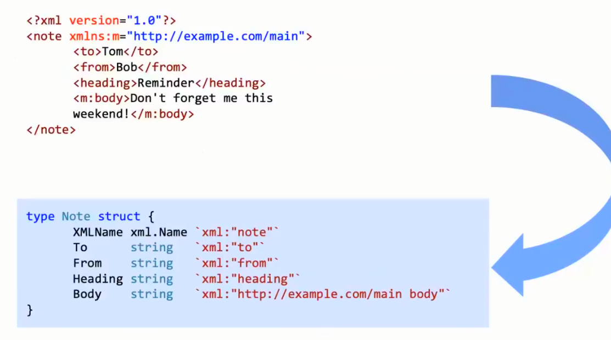

- [Excelize --操作excel的基础库](#excelize---操作excel的基础库)
- [官方文档:](#官方文档)
- [特色](#特色)
- [性能测试](#性能测试)
- [简单使用](#简单使用)
  - [Create spreadsheet](#create-spreadsheet)
  - [Reading spreadsheet](#reading-spreadsheet)
- [原理解析](#原理解析)
  - [技术原理(遵循的标准格式)](#技术原理遵循的标准格式)
  - [部分模块设计与实现](#部分模块设计与实现)

# Excelize --操作excel的基础库
Excelize 是 Go 语言编写的用于操作电子表格文档的基础库，支持 XLAM / XLSM / XLSX / XLTM / XLTX 等多种文档格式，高度兼容带有样式、图片(表)、透视表、切片器等复杂组件的文档，并提供流式读写支持，用于处理包含大规模数据的工作簿。可应用于各类报表平台、云计算、边缘计算等系统。已成为云原生应用尤其是 Go 语言开发者在处理电子表格办公文档时的热门选择，正在被广泛应用于大型互联网公司、中小企业客户和初创公司。

# 官方文档:
github: https://github.com/xuri/excelize

doc: https://xuri.me/excelize/zh-hans/

解读视频: https://www.bilibili.com/video/BV1K84y1q76p/?spm_id_from=333.999.0.0&vd_source=b2cf295439d07e14988685f456539db2
# 特色
你能想到的都有, `合并单元格`, `数据透析表`,`插入图表`, `流式写入` 

# 性能测试

# 简单使用
## Create spreadsheet
```go

package main

import (
    "fmt"

    "github.com/xuri/excelize/v2"
)

func main() {
    f := excelize.NewFile()
    // Create a new sheet.
    index := f.NewSheet("Sheet2")
    // Set value of a cell.
    f.SetCellValue("Sheet2", "A2", "Hello world.")
    f.SetCellValue("Sheet1", "B2", 100)
    // Set active sheet of the workbook.
    f.SetActiveSheet(index)
    // Save spreadsheet by the given path.
    if err := f.SaveAs("Book1.xlsx"); err != nil {
        fmt.Println(err)
    }
}
```

## Reading spreadsheet
```go
package main

import (
    "fmt"

    "github.com/xuri/excelize/v2"
)

func main() {
    f, err := excelize.OpenFile("Book1.xlsx")
    if err != nil {
        fmt.Println(err)
        return
    }
    defer func() {
        // Close the spreadsheet.
        if err := f.Close(); err != nil {
            fmt.Println(err)
        }
    }()
    // Get value from cell by given worksheet name and cell reference.
    cell, err := f.GetCellValue("Sheet1", "B2")
    if err != nil {
        fmt.Println(err)
        return
    }
    fmt.Println(cell)
    // Get all the rows in the Sheet1.
    rows, err := f.GetRows("Sheet1")
    if err != nil {
        fmt.Println(err)
        return
    }
    for _, row := range rows {
        for _, colCell := range row {
            fmt.Print(colCell, "\t")
        }
        fmt.Println()
    }
}
```
# 原理解析
## 技术原理(遵循的标准格式)
这些都是底下的库需要实现的标准或者是格式

`下面都是标准的解读组成`


## 部分模块设计与实现


解析中,需要对大量的xml序列化数据进行反序列化为golang struct, 然后再进行序列化输出xml回去

这里面其中很多命名空间,容易造成命名空间丢失的问题, 数据的类型对应也有很多的问题进行处理


