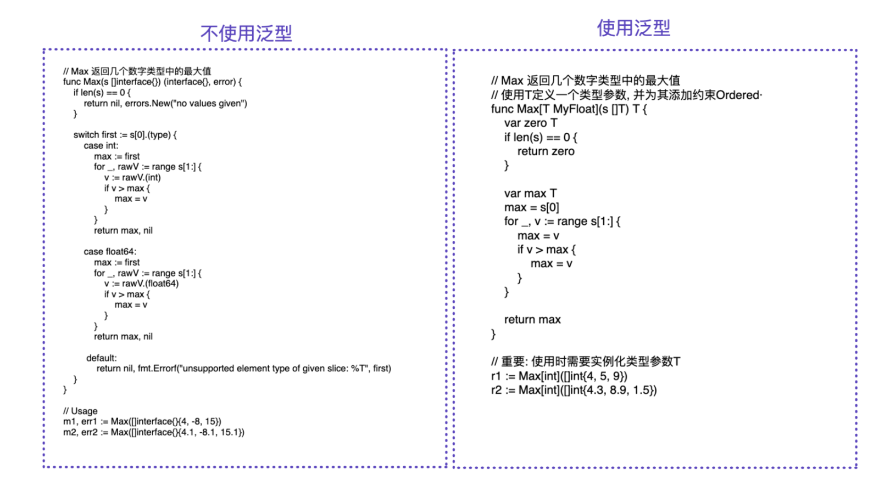

- [Go1.18变化](#go118变化)
- [如何升级](#如何升级)
- [Go1.18`泛型Generics`](#go118泛型generics)
  - [什么是泛型](#什么是泛型)
  - [语法详解](#语法详解)
    - [语法](#语法)
    - [`Constraint约束`是什么](#constraint约束是什么)
    - [自定义constraints(约束)](#自定义constraints约束)
  - [泛型使用](#泛型使用)
    - [泛型切片](#泛型切片)
    - [泛型map](#泛型map)
    - [泛型结构体](#泛型结构体)
    - [泛型通道](#泛型通道)
    - [泛型函数](#泛型函数)
    - [泛型变量嵌套](#泛型变量嵌套)
    - [泛型方法](#泛型方法)
      - [接收器泛型](#接收器泛型)
      - [方法参数泛型](#方法参数泛型)
    - [泛型接口](#泛型接口)
      - [基本接口泛型](#基本接口泛型)
- [sync包 `Mutex.TryLock`](#sync包-mutextrylock)
- [提供模糊测试Fuzzing](#提供模糊测试fuzzing)
- [Workspaces: 解决go mod 遗留下来的**本地多模块开发依赖问题**](#workspaces-解决go-mod-遗留下来的本地多模块开发依赖问题)


# Go1.18变化
官方文档查看 :https://go.dev/doc/go1.18  -- go1.18 Release变化
部分重点原文: 

The following is a list of **the most visible changes**. For a more comprehensive overview, see the proposal. For details see the language spec.

- **The syntax for function and type declarations now accepts type parameters.**
- Parameterized functions and types can be instantiated by following them with a list of type arguments in square brackets.
- The new token ~ has been added to the set of operators and punctuation.
- The syntax for Interface types now permits the embedding of arbitrary types (not just type names of interfaces) as well as union and ~T type elements. Such interfaces may only be used as type constraints. An interface now defines a set of types as well as a set of methods.
- The new predeclared identifier any is an alias for the empty interface. It may be used instead of interface{}. 
- The new predeclared identifier comparable is an interface that denotes the set of all types which can be compared using == or !=. It may only be used as (or embedded in) a type constraint.

当中还有一些`built-in`的包的变化, 比如`sync`
# 如何升级
官方包: https://go.dev/dl/

大概思路是: 下载最新包,解压,得到go18,再软链接到go上 (可以不保留以前版本)
```bash
# 查看当前go版本和位置
go version && which go
# go version go1.17.7 linux/amd64
# /usr/bin/go
# 之前是直接使用的yum install go安装的

# 下载1.18版本
wget https://go.dev/dl/go1.18.3.linux-amd64.tar.gz

# 解压&移动
tar -C /tmp/ -xzf go1.18.3.linux-amd64.tar.gz
sudo mv /tmp/go /usr/local/go18

# 往文件写入命令
cat << EOF >/usr/local/go18/bin/go18
unset GOROOT
go env -w GOROOT="/usr/local/go18/"
/usr/local/go18/bin/go \$@
EOF

# 查看文件里面的命令内容
cat /usr/local/go18/bin/go18
# unset GOROOT
# go env -w GOROOT="/usr/local/go18/"
# /usr/local/go18/bin/go $@

# 建立软连接
sudo ln -s /usr/local/go18/bin/go18 /usr/local/bin/go18

# 查看go版本
go18 version && go version
```

# Go1.18`泛型Generics`
更仔细可以参考博客: https://blog.csdn.net/qq_39280718/article/details/126786517
## 什么是泛型
就是函数的参数, 或者容器元素的类型, 支持更广泛的类型, 不再是某个特定的类型

**旧版本的例子**:
```go
func Sum(a, b int) int {
	return a + b
}
// 旧版本需要严格定义传入的参数,必须是int值
Sum(1,2) // 3
// 传入float会报错
Sum(1.1, 2.2) // cannot use 1.23 (untyped float constant) as int value in argument to Sum (truncated)

// 如果改正需要新建函数 或者使用interface接口判断
func SumFloat(a, b float) float { return a + b }

func SumInterface(a, b interface{}) return interface{} {
	switch a.type {
	case int: 
		a1 := a.(int)
		b1 := b.(int)
		return a1 + b1
    //...
	default: return nil
    }
}
```

看完上面的例子就会觉得很繁琐, 因为泛型出现了, 但是也是有缺点的:

在给开发者带来便利的同时，同样会带来编译和效率的问题，**因为泛型需要系统去推倒和计算变量的类型的，这在无形中会增加编译的时间和降低运行效率**。

图片来自于: https://cloud.tencent.com/developer/article/2043551


## 语法详解
### 语法

```bash
MyType[T1 constraint | constraint2, T2 constraint3...] ...
```
- `MyType` 可以是函数名function,结构体名struct,类型名称 type
- `T1``T2`...是泛型名, 可以随便取
- `constraint`的意思是约束 -- 泛型最重要概念
- `|` 可以分隔多个`constraint`
### `Constraint约束`是什么
作用就是限定范围,将`Type`限定在某种范围, 而我们常用的范围,有:
- `any`(`interface{}`, 任何类型)
- `Interger`(所有`int`)
- `Float`(所有`float`)
- `comparable`(所有可以**比较类型**, 我们可以给所有可以比较的类型定制一些方法)
- `Ordered`(包含比较方法的类型, < <= >= >)

上面这些都是内置类型, 就是涵盖在了`constraints`包里 文档: https://pkg.go.dev/golang.org/x/exp/constraints

### 自定义constraints(约束)
```golang
// constraints 部分源码
type Signed interface {
	~int | ~int8 | ~int16 | ~int32 | ~int64
}
```
- 使用`interface{}` 就可以自定义`constraints`约束
- 使用`|` 或 , 就可以包含需要的类型
- `~` 就是模糊匹配的意思
  - `type MyInt int64` 此时 MyInt 并不是等同于 `int64`类型
  - `int64`类型无法约束到`MyInt`, 因此需要使用`~`符号, 模糊匹配, `~int64`意思就是只要底层是`int64`就给约束

例子
```golang
type My_constraint_Num interface{
   ~int64 | ~float64 
}
```

## 泛型使用
### 泛型切片
```golang
package main
import "fmt"

type Vector[T any] []T
type NumberSlice[T int | float64] []T

func main() {
	v := Vector[string]{"a", "b", "c", "d", "e", "f"}
    fmt.Printf("v: %v\n", v)
	
	// 用float也可以
	ns := NumberSlice[int]{1, 2, 3, 4, 5}
	fmt.Printf("ns: %v\n", v)
}
```
### 泛型map
```golang
package main

import (
	"fmt"
	"golang.org/x/exp/constraints"
)

// map的key必须要可以比较, 也就是可以被 == 和 != 比较(用于处理哈希冲突)
type MyMap[K comparable, V constraints.Integer | constraints.Float] map[K]V

func main() {
	m := make(MyMap[string, int])   //  跟平常的map有点区别 m := make(map[string]int, 0)
	m["表哥"] = 100
	m["小张"] = 0
	for k, v := range m {
		fmt.Printf("key: %v, val: %v\n", k, v)
	}
}

```
### 泛型结构体
```golang
package main

import (
	"fmt"
	"golang.org/x/exp/constraints"
)

type MyIntergerNode[T constraints.Integer | constraints.Float] struct {
	Next *MyIntergerNode[T]	// 加类型声明
	Data	T
	Id int
}

func main() {
	head := &MyIntergerNode[float64]{Next: nil, Data: 5.5, Id: 2}
	head.Next = &MyIntergerNode[float64]{Next: nil, Data: 2.2}

	for p := head; p != nil; p = p.Next {
		fmt.Printf("%d ", p.Data)
	}
}

```
### 泛型通道
```golang
package main

import "fmt"

type Ch[T any] chan T

func main() {
  ch := make(Ch[int], 1)
  ch <- 10

  res := <-ch

  fmt.Printf("res: %v\n", res)
  fmt.Printf("ch: %v\n", ch)
}
```
### 泛型函数
```golang
package main

import (
	"fmt"
)
// 自定义约束
type My_64_Bits_Long_Num interface {
	~int64 | ~float64
}
//  对比以前函数定义就多了 [T My_64_Bits_Long_Num]
func MyCompare[T My_64_Bits_Long_Num] (a, b T) bool {
	return a < b
}

func main() {
  var a int64 = 1
  var b int64 = 8

  // 函数可以省略不写参数类型
  ans := MyCompare(a, b)
  if ans {
    fmt.Printf("%v小于%v", a, b)
  } else {
    fmt.Printf("%v大于%v", a, b)
  }
}
```
`ans := MyCompare(a, b)` // golang会自动推导出 T 是 int

### 泛型变量嵌套
```golang
type MyStruct[S int | string, P map[S]string] struct {
   Name string
   Content S
   Job P
}
// 实例化int的实参
var MyStruct1 = MyStruct[int, map[int]string] {
  Name:    "small",
  Content: 1,
  Job:     map[int]string{1: "ss"},
}

//实例化string的实参
var MyStruct2 = MyStruct[string, map[string]string]{
Name:    "small",
Content: "yang",
Job:     map[string]string{"aa": "ss"},
}

//  两个泛型变量之间的嵌套使用
//  切片泛型
type Slice1[T int | string] []T

//结构体泛型，它的第二个泛型参数的类型是第一个切片泛型。
type Struct1[P int | string, V Slice1[P]] struct {  // V 是 Slice1切片,切片的类型是 P 类型
  Name  P
  Title V
}

// 在泛型里面，如果要实例化一个泛型变量，需要用实际传入的变量类型去替换T
// 实例化切片
mySlice1 := Slice1[int]{1, 2, 3}

//用int去替换P, 用Slice1去替换Slice1[p]
myStruct1 := Struct1[int, Slice1[int]]{
Name:  123,
Title: []int{1, 2, 3},
}

//用string去替换P, 用Slice1去替换Slice1[p]
myStruct2 := Struct1[string, Slice1[string]]{
Name:  "hello",
Title: []string{"hello", "small", "yang"},
}

fmt.Println(mySlice1, myStruct1, myStruct2) //[1 2 3]  {123 [1 2 3]}  {hello [hello small yang]}

// 还有另一种嵌套,这里相当于 Slice2 继承了 Slice1,并且加了限制float64
type Slice1[T int|float64|string] []T
type Slice2[T int|string] Slice1[T]

```
### 泛型方法
```golang
type DemoInt int

func (t DemoInt) methodName(param string) string {}
```
前面的`t DemoInt` 或者方法的参数`param string` 里面都可以改造使用泛型

#### 接收器泛型
先定义一个泛型变量, 然后在这个变量上加上一个方法
```golang
//申请一个自定义的泛型约束类型
type NumberAll interface {
  ~int|~int64|~int32|~int16|~int8|~float64|~float32
}
 
//申请一个泛型切片类型，泛型参数是T，约束的类型是 NumberAll
type SliceNumber[T NumberAll] []T

//给泛型切片加上1个接收器方法, 遍历自身切片, 累积相加
func (s SliceNumber[T]) SumIntsOrFloats() T {
    var sum T   // 定义返回值
    for _, v := range s {
      sum += v
    }
    return sum
}

//  调用, 只是需要先去实例化泛型切片
//实例化成int
var ss1 SliceNumber[int] = []int{1, 2, 3, 4}

//简化
//ss1 := SliceNumber[int]{1, 2, 34}

ss1.SumIntsOrFloats() // 10

//实例化成float64
var ss2 SliceNumber[float64] = []float64{1.11, 2.22, 3.33}

//简化
//ss2 := SliceNumber[float64]{1.11, 2.22, 3.33}

ss2.SumIntsOrFloats()   //6.66

```
#### 方法参数泛型
当接收器是一个普通的类型，在方法的参数里面使用泛型变量，如下：
```golang

type DemoSlice []int

func (d DemoSlice) FindOne[T int](a T) bool {
}
```
这是会发现报错：`Method cannot have type parameters`，即：**方法是不支持泛型的**

既然函数支持泛型，接收器也支持泛型，所以我们把两者结合起来稍加修改：

```golang
type DemoSlice[T int | float64] []T
 
func (d DemoSlice[T]) FindOne(a T) bool {
  for _, t := range d {
    if t == a {
      return true
    }
  }
  return false
}
 
s1 := DemoSlice[int]{1, 2, 3, 4}
fmt.Println(s1.FindOne(1))
 
s2 := DemoSlice[float64]{1.2, 2.3, 3.4, 4.5}
fmt.Println(s2.FindOne(1.2))

```

### 泛型接口
- 如果一个接口里面只有方法，这个接口叫基本接口
- 如果一个接口里面有约束类型，有或者没有方法的，这个接口叫一般接口
#### 基本接口泛型
定义, 和定义泛型函数一样，在接口名后面接[]，里面填充的接口里面方法中需要用到泛型参数
```golang
type MyInterface[T int | string] interface {
	WriteOne(data T ) T
	ReadOne() T
}
// 错误示范, 写反了
//会提示错误：interface method must have no type parameters
type MyInterface interface {
WriteOne[T int | string] (data T) T
ReadOne[T int | string] () T
}
```


# sync包 `Mutex.TryLock` 
The new methods Mutex.TryLock, RWMutex.TryLock, and RWMutex.TryRLock, will acquire the lock if it is not currently held.

# 提供模糊测试Fuzzing

# Workspaces: 解决go mod 遗留下来的**本地多模块开发依赖问题**

