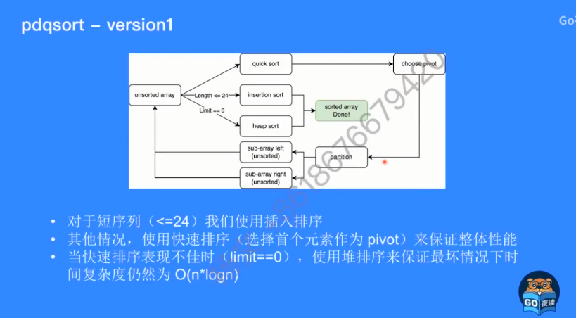
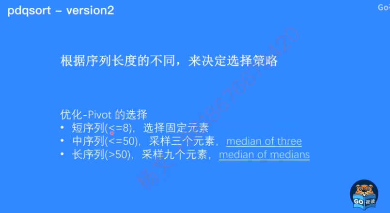
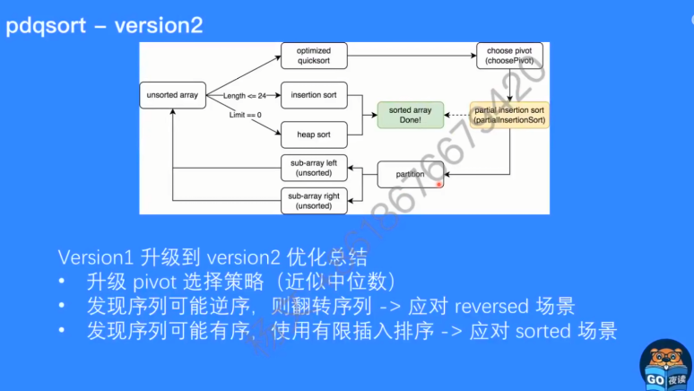
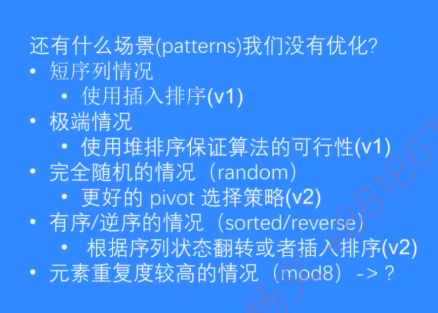
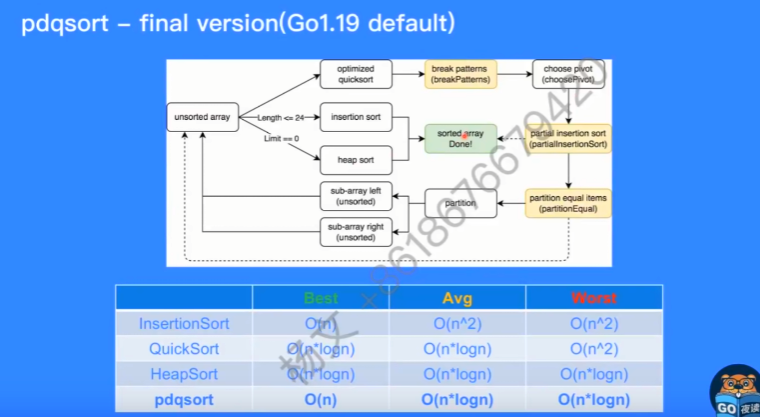

- [排序优化`pdqsort`](#排序优化pdqsort)
- [简介](#简介)
- [`pdqsort` 算法 \&\& 作者创作思路](#pdqsort-算法--作者创作思路)
  - [并发数据结构和算法优化](#并发数据结构和算法优化)
  - [runtime/标准库优化](#runtime标准库优化)
- [`Go1.19`默认使用`pdqsort`排序算法](#go119默认使用pdqsort排序算法)
  - [回忆经典算法](#回忆经典算法)
  - [如何实现? 为什么性能更好?](#如何实现-为什么性能更好)
  - [`pdqsort`算法为什么性能更好?](#pdqsort算法为什么性能更好)
  - [Go(\<=1.18) 的排序算法是快速排序? 其实是混合排序算法](#go118-的排序算法是快速排序-其实是混合排序算法)


# 排序优化`pdqsort`
参考文档: https://zhuanlan.zhihu.com/p/515426712

视频来自Go夜读: https://www.bilibili.com/video/BV1oG4y1x7xN/?spm_id_from=333.1007.tianma.1-1-1.click&vd_source=b2cf295439d07e14988685f456539db2

源码:  https://github.com/zhangyunhao116/pdqsort

# 简介
`pdqsort` 实质是一种混合排序算法, 其理想情况下的`时间复杂度为 O(n)`，最坏情况下的`时间复杂度为 O(n* logn)`，`不需要额外的空间`。

使用方法:
```go
import (
 "fmt"
 "github.com/zhangyunhao116/pdqsort"
)

func main() {
 x := []int{3, 1, 2, 4, 5, 9, 8, 7}
 pdqsort.Slice(x)
 fmt.Printf("sort_result = %v\n", x)    // 排序好
 search_result := pdqsort.Search(x, 4)  
 fmt.Printf("search_result = %v\n", search_result) // 3
 is_sort := pdqsort.SliceIsSorted(x)    // true
 fmt.Printf("is_sort = %v\n", is_sort)
}
```
# `pdqsort` 算法 && 作者创作思路
## 并发数据结构和算法优化
`Is Go Scalable?` -- True, 因为`goroutine`关键字多线程会充分运用多核能力,但有些库并没有达到效果
比如:

*  `math/rand` : `PRNG`(pseudo random number generator unscalable)-生成伪随机数,高并发场景性能不佳, 里面有锁 
   *  解决方法: `fastrand`, 实现scalable的PRNG, 性能提升 
*  `sync.Map`: 高并发场景性能不佳, 整体unscalable
   *  解决: `skipmap/skipset` 基于`skiplist`实现 scalable的sorted map/set,性能提升10x ~15 x
*  `channel` 也是用到了锁
   *  解决: `LSCQ`, scalable FIFO queue, 提升
## runtime/标准库优化
- sort算法更换为pdqsort, 实现泛型和interface{}版本, 在`Go1.19`合并
- runtime `hashmap` 数据结构更换为 `SwissTable`新式哈希表, 目前正在推向
  - 这里可以参考文档了解新式哈希表: https://zhuanlan.zhihu.com/p/277732297
  
# `Go1.19`默认使用`pdqsort`排序算法
## 回忆经典算法
Insertion Sort 插入排序: 将元素不断插入已经排序号的array中, Best: O(n), Avg:O(n^2) Worst: O(n^2), 缺点: 平均最坏都是O(n^2)

Quick Sort 快速排序: 分治思想, 不断分割序列直到序列整体有序, Best: O(n*logn) Avg: O(n*logn) Worst: O(n^2) 缺点: 最坏复杂度高达 O(n^2)

Heap Sort 堆排序: 利用堆性质形成的排序算法, Best, Avg Worst: O(n*logn)

在随机元素排序中, 插入排序一般适合短序列 len< 30; 其他情况 快排最快, 堆排序相差快排不多
## 如何实现? 为什么性能更好?
能不能把上面算法都结合到一起呢?答案: 可以的

`pdqsort(pattern-defeating-quicksort)` 不稳定的排序算法(不稳定就是相同元素可能会调换位置)

结合三种排序方法优点:
- 短序列 使用插入排序
- 其他情况,使用快排
- 快排表现不佳,使用堆排序保证最坏情况下时间复杂度仍然为O(n*logn)

Q&A

**短序列长度**: 12~32 

**如何得知快排表现不佳, 以及切换到堆排序?**

当最终pivot(界限)的位置离序列两端很接近时(距离小于length/8)判定其表现不佳, 当这种情况次数达到`limit`(即bits.len(length))时,切换到堆排序


`version1`


**如何让pdqsort更快?**
- 尽量让QuickSort的pivot(基准)更接近中位数 -> 改进 choose pivot
  - 思考关于pivot选择
    - 使用首个元素作为pivot, sorted情况下性能很差
    - 遍历找到真正的中位数, 但是代价高
  - `所以寻找一个近似中位数`,更容易平衡
- Partition速度更快 -> 改进partition, 但是此优化在go表现不好 略
  
`version2` 


Pivot采样方式使得我们有探知序列当前状态能力

采样的元素都是逆序排列 => 序列可能已经逆序 => 翻转整个

采样元素都是顺序排列 => 序列可能已经有序 => 使用插入排序 



`还有什么场景没优化呢?`


`final version`


## `pdqsort`算法为什么性能更好?
关键是**会及时感知待排序序列的状态,使用不同的策略来进行排序

## Go(<=1.18) 的排序算法是快速排序? 其实是混合排序算法
Go <=1.18时的算法也是基于快速排序, 和pdqsort的区别在于fallback时机,pivot选择策略,是否有针对不同Patterns优化等
