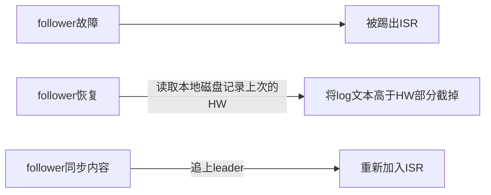
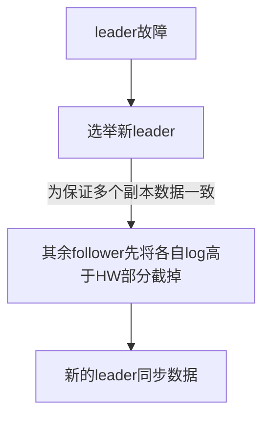
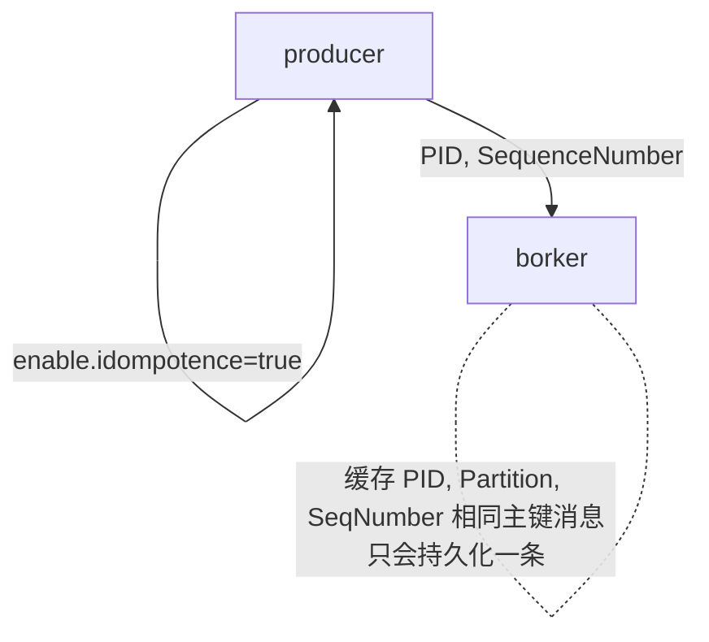

- [1.定义](#1定义)
  - [面试题](#面试题)
    - [使用消息队列好处：](#使用消息队列好处)
  - [发布/订阅模式](#发布订阅模式)
- [2.架构](#2架构)
    - [基本概念](#基本概念)
- [3.工作流程](#3工作流程)
    - [`offset`作用](#offset作用)
- [4.存储机制](#4存储机制)
- [5.生产者](#5生产者)
  - [5.1 分区策略](#51-分区策略)
    - [5.1.1 分区原因](#511-分区原因)
    - [5.1.2 分区原则](#512-分区原则)
  - [5.2 数据可靠性保证](#52-数据可靠性保证)
    - [5.2.1 副本数据同步策略](#521-副本数据同步策略)
    - [5.2.2 ISR 动态follower集合](#522-isr-动态follower集合)
    - [5.2.3 `ack`应答机制](#523-ack应答机制)
    - [5.2.4 故障处理细节](#524-故障处理细节)
  - [5.3 `Exactly Once`语义](#53-exactly-once语义)
  - [6.2 分区分配策略](#62-分区分配策略)


文档：

[Kafka 概述：深入理解架构](https://juejin.im/post/5e217c3fe51d450200787f23)

# 1.定义

`Kafka` --分布式的，基于发布/订阅模式的消息队列（`Message Queue`)

擅长大数据实时处理领域

## 面试题

### 使用消息队列好处：

*   <u>**解耦**</u>：允许我们独立的扩展或修改队列两边的处理过程。
*   <u>**可恢复性**</u>：即使一个处理消息的进程挂掉，加入队列中的消息仍然可以在系统恢复后被处理。
*   <u>**缓冲**</u>：有助于解决生产消息和消费消息的处理速度不一致的情况。
*   <u>**灵活性&峰值处理能力**</u>：不会因为突发的超负荷的请求而完全崩溃，消息队列能够使关键组件顶住突发的访问压力。
*   <u>**异步通信**</u>：消息队列允许用户把消息放入队列但不立即处理它。

## 发布/订阅模式


*   一对多，生产者将消息发布到 Topic 中，有多个消费者订阅该主题
*   发布到 Topic 的消息会被所有订阅者消费，被消费的数据不会立即从 Topic 清除。

# 2.架构


*   多个product生产消息，数据可以被发布到多个`topic`下，每个`topic`有多个分区
*   一个分区内，　消息被索引以及时间戳储存一起，　`Consumer`可以从分区订阅消息

### 基本概念

*   `Producer`　生产者
*   `Consumer`　消息消费者
*   `Consumer Group` `CG` 消费者组，组内每个`C`消费不同分区消息
    *   一个分区只能由组内一个`C`消费，　消费者组之间互不影响
*   `Broker` 一台`Kafka`机器　就是一个`Broker`
    *   一个集群多个`Broker`，一个`Broker`容纳多个`Topic`
*   `Topic`　可以理解为一个队列，`Topic`将消息分类，　`Producer` `Consumer`面向同一个`Topic`
*   `Partition` 分片　实现扩展性提高并发
    *   一个大`Topic`可以分布到多个`Broker`上
    *   一个`Topic`可以分为多个`partition`，每个`partition`是一个有序队列
*   `Replica` 备份功能，副本机制，一个`Topic`的每个分区都有若干个副本，　一个`Leader`和若干个`Follower`
    *   `Leader`：每个分区多个副本的“主”副本，生产者发送数据的对象，以及消费者消费数据的对象，都是 Leader。
    *   `Follower`：每个分区多个副本的“从”副本，实时从 Leader 中同步数据，保持和 Leader 数据的同步。Leader 发生故障时，某个 Follower 还会成为新的 Leader。
*   `Offset` :消费者消费的位置信息，监控数据消费到什么位置，当消费者挂掉再重新恢复的时候，可以从消费位置继续消费。
*   `ZooKeeper`：`Kafka` 集群能够正常工作，需要依赖于 `ZooKeeper`，`ZooKeeper` 帮助 `Kafka` 存储和管理集群信息。

# 3.工作流程


Kafka 是一个分布式流平台

*   发布和订阅记录流，类似于消息队列或企业消息传递系统。
*   以容错的持久方式存储记录流。
*   处理记录流。

`Kafka `中消息是以`Topic`进行分类的，生产者生产消息，消费者消费消息，面向的都是同一个 `Topic`。

`Topic` 是逻辑上的概念，而 `Partition` 是物理上的概念

### `offset`作用

每个 Partition 对应于一个 log 文件，该 log 文件中存储的就是 `Producer` 生产的数据。

Producer 生产的数据会不断追加到该 log 文件末端，且每条数据都有自己的 `Offset`。

消费者组中的每个消费者，都会实时记录自己消费到了哪个 Offset，以便出错恢复时，从上次的位置继续消费。

# 4.存储机制


**为防止 log 文件过大导致数据定位效率低下，Kafka 采取了`分片`和`索引机制`。**

它将每个 `Partition` 分为多个 Segment，每个 `Segment `对应两个文件：`“.index”` 索引文件和 `“.log”` 数据文件。

```bash
    # ls /root/data/kafka/first-0

    00000000000000009014.index    

    00000000000000009014.log

    00000000000000009014.timeindex

    00000000000000009014.snapshot   

    leader-epoch-checkpoint
```

index 和 log 文件以当前 Segment 的第一条消息的 Offset 命名。下图为 index 文件和 log 文件的结构示意图：


`“.index”` 文件存储大量的索引信息，`“.log” `文件存储大量的数据，索引文件中的元数据指向对应数据文件中 Message 的物理偏移量。

# 5.生产者

## 5.1 分区策略

### 5.1.1 分区原因

*   方便扩展, 每个`partition`都可以调整适应自身机器, 一个`topic`由多个`partition`组成
    *   因此都以`partition`单位进行读写
    *   提高并发

### 5.1.2 分区原则

将`Producer` 发送的消息封装为 `ProducerRecord`, 指定参数如下:

*   `topic`: string, Not Null--------相当于指定队列
*   `partition`: int. 可选-----指定分区partition几
*   `timestamp`: long, 可选
*   `key`: string, 可选
*   `value`: string, 可选
*   `header`: array, nullable

1.  指明`partition` 时候, 直接将`key`作为`partition`的值
2.  只指明`key`时候, 将`key`的`hash`值与分区数取余得到`partition`
3.  没有`partition`和`key`时, 第一次调用随机生成整数(后面每次调用都在这整数自增), 将整数与可用分区数取余,得到`partition`
    *   `round-robin`轮询算法

## 5.2 数据可靠性保证

`topic`中每个`partition`收到`producer`发送的消息后, 都需要给`producer`发送`ack`(`acknowledge`确认收到)

收到`ack`, `producer`才会继续下一轮发数据, 不然只会重新发送


### 5.2.1 副本数据同步策略

**(1) 何时发送`ack`**

确保有`Follower`与`leader`同步完成, `leader`再发送`ack`

这才能保证`leader`挂掉后, 能选举`Follower`而不丢失数据

**(2) 多少个`follower`同步完成后发送`ack`?**

全部`follower`完成才发送


### 5.2.2 ISR 动态follower集合

采用第二种方案，所有 follower 完成同步，producer 才能继续发送数据

问题: `follower`出现故障,`learder`就要一直等到它完成同步吗? 问题怎么解决

**解决:** leader维护了一个动态的` in-sync replica set（ISR）`：和 leader 保持同步的 follower 集合。

*如果`follower`长时间未回复`ack`, `ISR`会踢出此`follower`*

> 此时间阈值由 replica.lag.time.max.ms 决定, leader故障后, 从ISR选举新的

### 5.2.3 `ack`应答机制

根据可靠性和延迟要求进行权衡, `kafka`提供三种:

1.  **0:**`producer`不等待`broker`的`ack`, **延迟最少** `broker`一收到数据还没有写入磁盘马上就返回,`broker`故障时**有可能丢失数据**
2.  \*\*1: \*\* `producer`等待`broker`的`ack`, `partition`的`leader`落盘后就返回`ack`, **但是在`follower`同步成功之前`leader`故障, 有可能丢失数据**
3.  \*\*-1(all) \*\*: 等待`broker`的`ack`, `partition`的`leader`和`follower`都落盘才返回, **延迟性最高**
    *   在`broker`准备发送`ack`时如果故障,可能造成数据重复


### 5.2.4 故障处理细节


> LEO: 每个副本最大的offset
>
> HW: 消费者能见到的最大offset,  是ISR队列中最小的LEO

**(1) Follower 故障**



**(2) Leader故障**



**注意: 这只能保证副本之间数据一致性, 并不能保证数据不丢失或者不重复**

## 5.3 `Exactly Once`语义

*   ` ACK`级别设置为-1(all), 可以保证`producer`到`server`之间不丢失数据, ---**`At Least Once`**
*   级别为`0`, 保证数据只会被发送一次, ----**`At Most Once`**

> At Least Once 可以保证数据不丢失，但是不能保证数据不重复；相对的，At Most Once 可以保证数据不重复，但是不能保证数据不丢失

**Exactly Once** 语义: <u>数据消费者要求数据既不重复也不丢失</u>

> 0.11版本的 Kafka，引入了**幂等性**：producer 不论向 server 发送多少重复数据，server 端都只会持久化一条。即：

```bash
At Least Once + 幂等性 = Exactly Once   
```



> 但是 PID 重启后就会变化，同时不同的 partition 也具有不同主键，所以幂等性无法保证跨分区会话的 Exactly Once

## 6.2 分区分配策略

分区问题：即确定哪个`partition`由哪个`consumer`消费

Kafka有两种策略：`RoundRobin` , 和`Range`（默认），当消费者组内消费者发生变化时，会触发策略，方法重新分配

**（１）`RoundRobin`**


    将分区所有作为一个整体进行` hash` 排序, 消费者组内分配分区个数最大差别为1，是按照组来分的，可以解决多个消费者消费数据不均衡的问题。

\*\*缺点：\*\*消费者组内订阅不同主题，可能造成消费混乱


