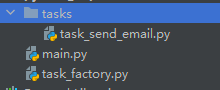

# `Python`动态加载模块并且调用
## 背景:
刚好看到工作上的项目一个写法挺有意思的, 就是通过参数`task_name`传入,来执行对应`py`的`task`的`run`方法

## 原理
使用`importlib`导入模块,使用`os.walk()`查找对应文件夹所有文件, 也使用到了工厂函数

# 代码
## 文件目录


main.py
```python
import random

from task_factory import TaskFactory

if __name__ == "__main__":
    # you can use other task_name
    task_name = "send_email"
    your_params = dict(duration=random.randint(1, 100))
    res, task_obj = TaskFactory.create_task(task_name)
    if not res:
        print(task_obj)
        pass
    task_obj.run(your_params)

```
task_factory.py
```python
import os
import importlib


class TaskFactory:
    def __init__(self):
        pass

    @staticmethod
    def create_task(task_name: str):
        if len(task_name) == 0:
            return False, "No task"

        exists = False
        for _, _, files in os.walk("./tasks"):
            for file in files:
                print("file: ", file)
                if file == str("task_" + task_name + ".py"):
                    exists = True
                    break

        if not exists:
            return False, "No file called task_{}".format(task_name + ".py")
        # get the object
        task_py = importlib.import_module("tasks.task_{}".format(task_name))
        task_obj = task_py.Task()
        if not hasattr(task_obj, "run"):
            return False, "task_{} have not attr run".format(task_name)
        return True, task_obj
```
tasks/task_send_email.py
```python
class Task:
    def __init__(self):
        self.name = "send_email"
        self.duration = 20
        self.support_robot = False

    def run(self, params: dict):
        print("name: {} duration: {}".format(self.name, self.duration, self.support_robot))
        print("params: ", params)
        pass

```