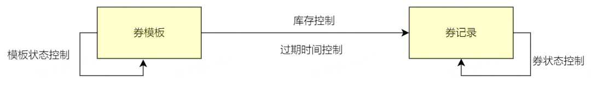
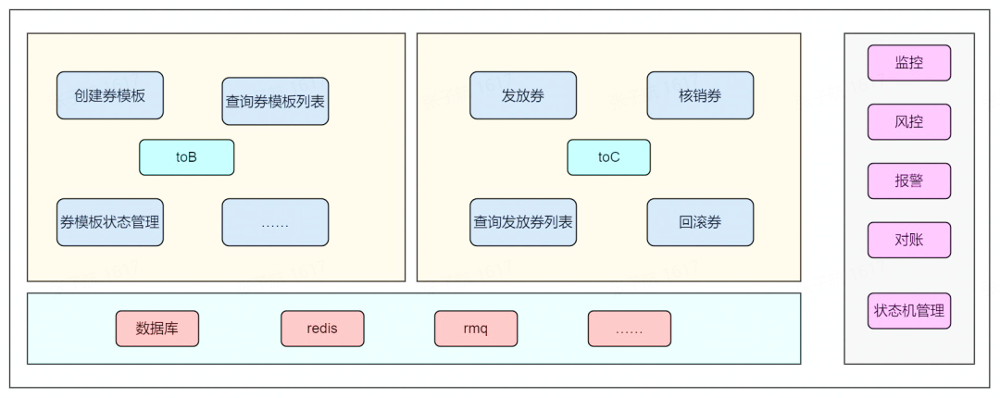
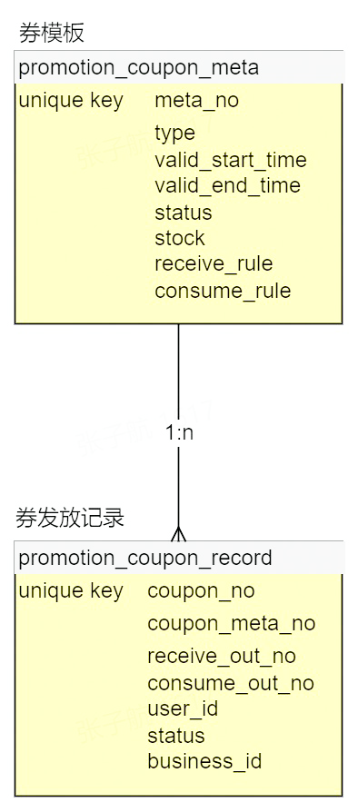
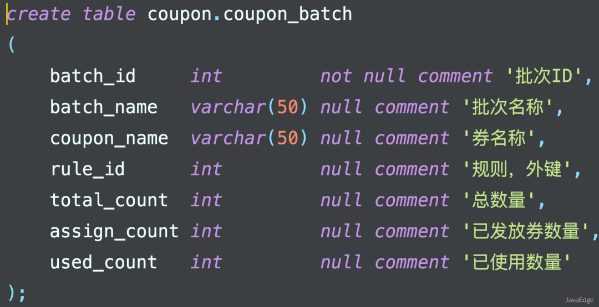
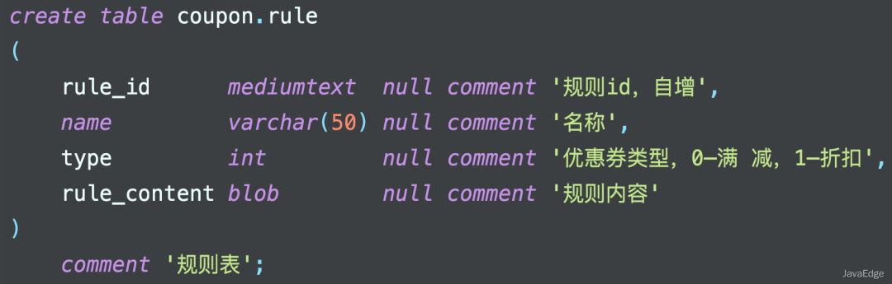
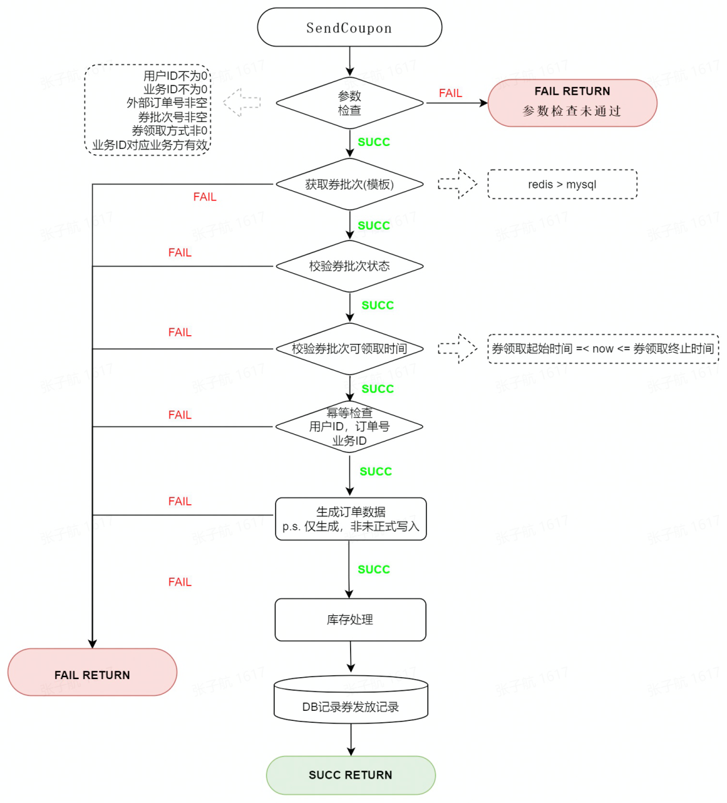

- [从零搭建10万级 QPS 大流量、高并发优惠券系统](#从零搭建10万级-qps-大流量高并发优惠券系统)
- [需求](#需求)
  - [拆解及技术选型](#拆解及技术选型)
  - [缓存](#缓存)
  - [消息列队](#消息列队)
  - [系统框架](#系统框架)
- [系统开发与实践](#系统开发与实践)
  - [整体架构](#整体架构)
  - [核心逻辑](#核心逻辑)
    - [发券](#发券)
    - [券过期](#券过期)
    - [快过期券提醒](#快过期券提醒)
    - [支付\&券操作记录](#支付券操作记录)
- [大流量,高并发场景下的问题及解决方案](#大流量高并发场景下的问题及解决方案)
  - [存储瓶颈](#存储瓶颈)
    - [容量预估:](#容量预估)
  - [热点库存问题及解决](#热点库存问题及解决)
    - [解决方案:](#解决方案)
    - [建券](#建券)
    - [库存扣减](#库存扣减)
    - [扣减问题](#扣减问题)
  - [券模板获取失败问题及解决](#券模板获取失败问题及解决)
    - [解决](#解决)
  - [服务治理](#服务治理)

# 从零搭建10万级 QPS 大流量、高并发优惠券系统
参考博客: https://blog.csdn.net/ByteDanceTech/article/details/124207051

也有部分参考: https://blog.csdn.net/hollis_chuang/article/details/125056773

# 需求
设计,开发一个能够支持十万级别QPS的券系统, 并且对优惠券完整的生命周期进行维护, 除了券管理,还有涉及到支付过程
## 拆解及技术选型
- 要配置券，会涉及到券批次（券模板）创建，券模板的有效期以及券的库存信息
- 要发券，会涉及到券记录的创建和管理（过期时间，状态）



## 缓存
- 使用redis作为缓存中间件
- 由于发券时需要券模板信息，大流量情况下，不可能每次都从 MySQL 获取券模板信息，因此考虑引入缓存 
- 同理，券的库存管理，或者叫库存扣减，也是一个高频、实时的操作，因此也考虑放入缓存中

## 消息列队
由于券模板/券记录都需要展示过期状态或者过期自动删除，并且根据不同的状态进行业务逻辑处理，因此有必要引入延迟消息队列来对券模板/券状态进行处理。RocketMQ 支持延时消息，因此我们选用 RocketMQ 作为消息队列。

## 系统框架
发券系统作为下游服务，是需要被上游服务所调用的。公司内部服务之间，采用的都是 RPC 服务调用，系统开发语言使用的是 golang，因此我们使用 golang 服务的 RPC 框架 kitex 进行代码编写。

我们采用 `kitex+MySQL+Redis+RocketMQ` 来实现发券系统，`RPC` 服务部署在公司的 `docker` 容器中。

# 系统开发与实践
## 整体架构

类似的ER图:

可以使用券批次表 和 规则表 结合


## 核心逻辑
### 发券
发券流程分为三部分：参数校验、幂等校验、库存扣减。

幂等操作用于保证发券请求不正确的情况下，业务方通过重试、补偿的方式再次请求，可以最终只发出一张券，防止资金损失。

触达系统: 可以通过短信邮件,第三方接口方式实现, 站内信可以通过数据库插入记录实现
### 券过期

由于 RocketMQ 支持的延时消息有最大限制，而卡券的有效期不固定，有可能会超过限制，所以我们将卡券过期消息循环处理，直到卡券过期。
### 快过期券提醒
定时扫券表
缺点：扫描数据量太大，随着历史数据越来越多，会影响线上主业务，最终导致慢SQL。

延时消息
缺点：有些券的有效时间太长了(30天)以上，有可能造成大量 MQ 积压

新增通知表
优点：扫描的数据量小，效率高。删除无用的已通知的数据记录
```sql
create table t_notify_msg
(
    id          bigint auto_increment comment '自增主键',
    coupon_id   bigint       null comment '券id',
    user_id     bigint       null comment '用户id',
    notify_day  varchar(255) null comment '需要执行通知的日期',
    notify_type int          null comment '通知类型，1-过期提醒',
    notif_time  timestamp    null comment '通知的时间，在该时间戳所在天内通知',
    status      int          null comment '通知状态，0-初始状态、1-成功、2-失败',
    constraint t_notify_msg_id_uindex
        unique (id)
);
 
 
alter table t_notify_msg
    add primary key (id);
```
- 在创建优惠券的时候就将需要提醒的记录插入提醒表中notify_msg 
- 把用户ID+批次ID+通知日期作为唯一索引，防止同一个批次有重复的记录通知，保证每天只会被通知一次 
- 建立notify_time，通知时间索引，每日的通知扫描通过该索引列查询，通过索引列来提高查询效率 
- 通知完成后该表中的数据变失去了意义，通过定时任务将该数据删除
### 支付&券操作记录
采用TCC ,`Try-Confirm-Cancel`解决


# 大流量,高并发场景下的问题及解决方案
## 存储瓶颈
单个服务器的IO能力终是有限的, 普通情况下:
- 单个 MySQL 的每秒写入在 4000 QPS 左右，超过这个数字，MySQL 的 I/O 时延会剧量增长。
- MySQL 单表记录到达了千万级别，查询效率会大大降低，如果过亿的话，数据查询会成为一个问题。
- Redis 单分片的写入瓶颈在 2w 左右，读瓶颈在 10w 左右

解决方法:
- 读写分离
- 数据分治, 即分库分表
- 发券,归根结底是要对用户的领券记录做持久化存储。对 MySQL 做水平扩容，这样一来，写请求就会分布在不同的 MySQL 主机上，这样就能够大幅提升 MySQL 整体的吞吐量。
- 给用户发了券，那么用户肯定需要查询自己获得的券。基于这个逻辑，我们以 user_id 后四位为分片键，对用户领取的记录表做水平拆分，以支持用户维度的领券记录的查询。 -- 基因法
- 每种券都有对应的数量，在给用户发券的过程中，我们是将发券数记录在 Redis 中的，大流量的情况下，我们也需要对 Redis 做水平扩容，减轻 Redis 单机的压力。
### 容量预估:
基于上述思路，在要满足发券 12w QPS 的需求下，我们预估一下存储资源。

a. MySQL 资源

在实际测试中，单次发券对 MySQL 有一次非事务性写入，MySQL 的单机的写入瓶颈为 4000，据此可以计算我们需要的 MySQL 主库资源为：`120000/4000 = 30`
b. Redis 资源

假设 12w 的发券 QPS，均为同一券模板，单分片的写入瓶颈为 2w，则需要的最少 Redis 分片为：`120000/20000 = 6`

## 热点库存问题及解决
大流量发券场景下，如果我们使用的券模板为一个，那么每次扣减库存时，访问到的 Redis 必然是特定的一个分片，因此，一定会达到这个分片的写入瓶颈，更严重的，可能会导致整个 Redis 集群不可用。
### 解决方案:
热点库存的问题，业界有通用的方案：即，扣减的库存 key 不要集中在某一个分片上。如何保证这一个券模板的 key 不集中在某一个分片上呢，我们拆 key（拆库存）即可。如图：

在业务逻辑中，我们在建券模板的时候，就将这种热点券模板做库存拆分，后续扣减库存时，也扣减相应的子库存即可。
### 建券

### 库存扣减

### 扣减问题
这里还剩下一个问题，即：扣减子库存，每次都是从 1 开始进行的话，那对 Redis 对应分片的压力其实并没有减轻，因此，我们需要做到：`每次请求，随机不重复的轮询子库存`。以下是本项目采取的一个具体思路：

Redis 子库存的 key 的最后一位是分片的编号，如：xxx_stock_key1、xxx_stock_key2……，在扣减子库存时，我们先生成对应分片总数的随机不重复数组，如第一次是[1,2,3]，第二次可能是[3,1,2]，这样，每次扣减子库存的请求，就会分布到不同的 Redis 分片上，缓轻 Redis 单分片压力的同时，也能支持更高 QPS 的扣减请求。

这种思路的一个问题是，当我们库存接近耗尽的情况下，很多分片子库存的轮询将变得毫无意义，因此`我们可以在每次请求的时候，将子库存的剩余量记录下来，当某一个券模板的子库存耗尽后，随机不重复的轮询操作直接跳过这个子库存分片，这样能够优化系统在库存即将耗尽情况下的响应速度。`

业界针对 Redis 热点 key 的处理，除了分 key 以外，还有一种 key 备份的思路：即，将相同的 key，用某种策略备份到不同的 Redis 分片上去，这样就能将热点打散。这种思路适用于那种读多写少的场景，不适合应对发券这种大流量写的场景。在面对具体的业务场景时，我们需要根据业务需求，选用恰当的方案来解决问题。

## 券模板获取失败问题及解决
高 QPS，高并发的场景下，即使我们能将接口的成功率提升 0.01%，实际表现也是可观的。现在回过头来看下整个发券的流程：查券模板（Redis）-->校验-->幂等（MySQL）--> 发券（MySQL）。在查券模板信息时，我们会请求 Redis，这是强依赖，在实际的观测中，我们会发现，Redis 超时的概率大概在万分之 2、3。因此，这部分发券请求是必然失败的。

### 解决
为了提高这部分请求的成功率，我们有两种方案。

一是`从 Redis 获取券模板失败时，内部进行重试`；二是`将券模板信息缓存到实例的本地内存中，即引入二级缓存`。

内部重试可以提高一部分请求的成功率，但无法从根本上解决 Redis 存在超时的问题，同时重试的次数也和接口响应的时长成正比。二级缓存的引入，可以从根本上避免 Redis 超时造成的发券请求失败。因此我们选用二级缓存方案：


当然，引入了本地缓存，我们还需要在每个服务实例中启动一个定时任务来将最新的券模板信息刷入到本地缓存和 Redis 中，`将模板信息刷入 Redis 中时，要加分布式锁，防止多个实例同时写 Redis 给 Redis 造成不必要的压力`。

## 服务治理
系统开发完成后，还需要通过一系列操作保障系统的可靠运行。

- 超时设置。优惠券系统是一个 RPC 服务，因此我们需要设置合理的 RPC 超时时间，保证系统不会因为上游系统的故障而被拖垮。例如发券的接口，我们内部执行时间不超过 100ms，因此接口超时我们可以设置为 500ms，如果有异常请求，在 500ms 后，就会被拒绝，从而保障我们服务稳定的运行。

- 监控与报警。对于一些核心接口的监控、稳定性、重要数据，以及系统 CPU、内存等的监控，我们会在 Grafana 上建立对应的可视化图表，在春节活动期间，实时观测 Grafana 仪表盘，以保证能够最快观测到系统异常。同时，对于一些异常情况，我们还有完善的报警机制，从而能够第一时间感知到系统的异常。

- 限流。优惠券系统是一个底层服务，实际业务场景下会被多个上游服务所调用，因此，合理的对这些上游服务进行限流，也是保证优惠券系统本身稳定性必不可少的一环。

- 资源隔离。因为我们服务都是部署在 docker 集群中的，因此为了保证服务的高可用，服务部署的集群资源尽量分布在不同的物理区域上，以避免由集群导致的服务不可用